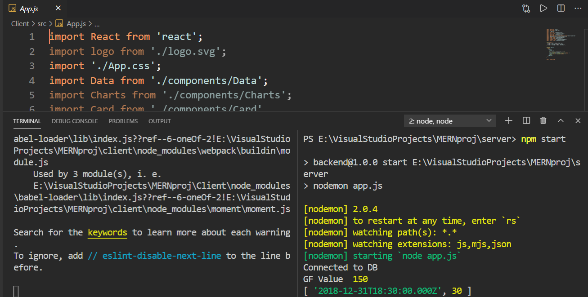
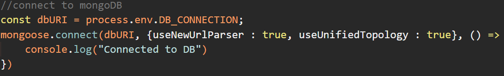

# Green Factor Calculator and Visualizer

### Table of Contents


- [Description](#description)
- [How To Use](#how-to-use)
- [References](#references)
- [Author Info](#author-info)

---

## Description

The target of the project is to find the green factor (quantative measure of bio-dgradablity) of clothes and products. The green factor for the clothes is calculated by the material it is made of and visualized.


The green factor can be used as a search bar for sorting and classification of products on the basis of biodegradablity and eco-friendliness.

#### Technologies

- MERN stack
- Chart.js
- D3.js (in future)

[Back To The Top](#read-me-template)

---

## How To Use

#### Installation

To run the project

```bash
cd client
```

```bash
npn install
```

```bash
npn start
```
A browser window will open.


This confirms the app is running fine.


To run server side, in the new terminal run the following commands

```bash
cd server
```

```bash
npn install
```

```bash
npn start
```

For the database, make a free account of MongoDB, and copy the URL provided. Make a **.env file** and paste the URL there. 


This shows how to imprt to import mongoDB URL from the **.env file**.


[Back To The Top](#read-me-template)

---

## Author Info

- Github - [100sarthak100](https://github.com/100sarthak100)
- Github - [mehular0ra](https://github.com/mehular0ra)

[Back To The Top](#read-me-template)
